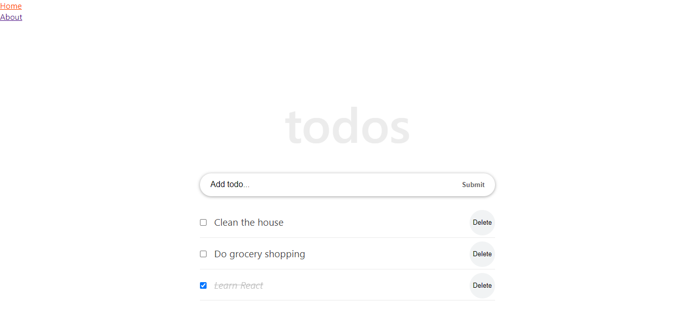

# Todo List React App

<a href="https://jaujau088.github.io/todo-list-react/build/"></a>
> This is a Todo List web app made by following [React Tutorial From Scratch: A Step-by-Step Guide (2021)](https://ibaslogic.com/react-tutorial-for-beginners/) by [Ibas Majid](https://github.com/Ibaslogic)!

## Built With

- React
- React router DOM v5.3.3
- JavaScript (ES6)
- CSS

## Live Demo

:fire::fire: https://jaujau088.github.io/todo-list-react/build/ :fire::fire:

## Getting Started

To get a local copy up and running follow these simple steps:

### Prerequisites

- Node.js
- npm

### Setup

- Clone the project
```terminal
git clone git@github.com:JauJau088/todo-list-react.git
```

- cd into the project directory
```terminal
cd todo-list-react
```

- Once you've cloned the repo and are inside the directory, run `npm install` command to get all necessary installations.

- **Yep, that's it!** you are now all set and simply run `npm start` to get your clone up and running on the browser.

## Author

👤 **Jauhari Alafi**

- GitHub: [@JauJau088](https://github.com/JauJau088)
- Twitter: [@jaujauj](https://twitter.com/jaujauj)
- LinkedIn: [Jauhari Alafi](https://linkedin.com/in/jauhari-alafi/)

## 🤝 Contributing

Contributions, issues, and feature requests are welcome!

Feel free to check the [issues page](../../issues/).

## Show your support

Give a ⭐️ if you like this project!

## Acknowledgments

- [Ibas Majid](https://github.com/Ibaslogic). Thank you for the wonderful and thorough tutorial! 🙏

## 📝 License

This project is [MIT](./MIT.md) licensed.
